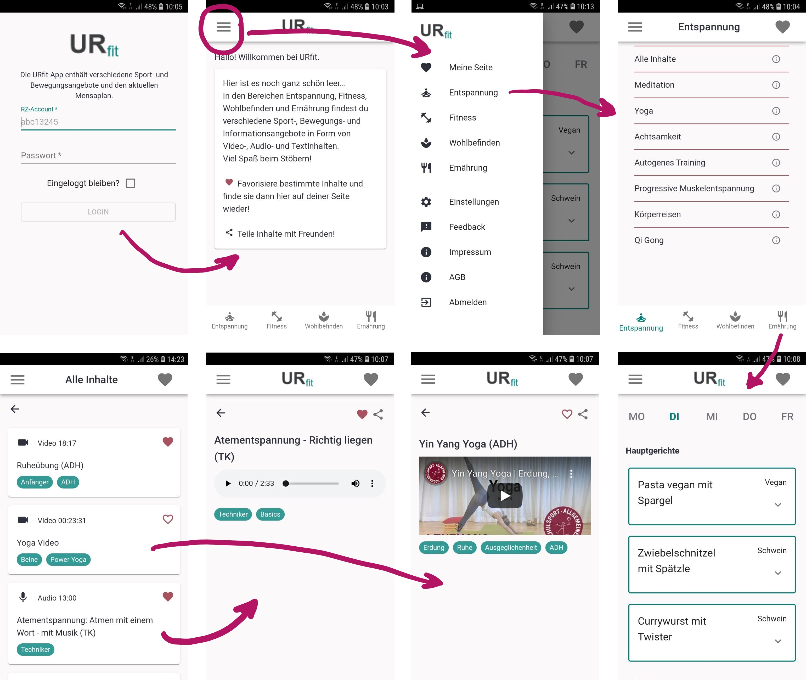
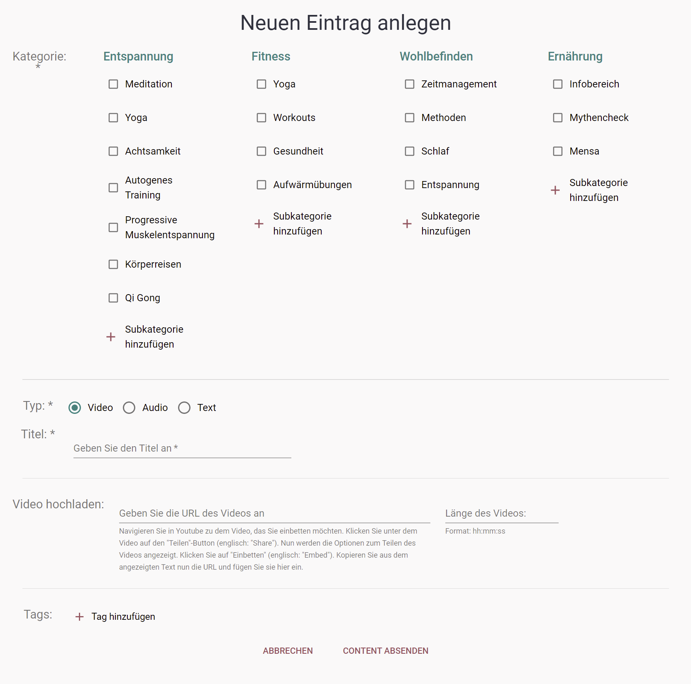

# Our App for the Regensburg University: URfit

## Welcome to the URfit App

This application is being created as part of the course "Advanced Software Engineering" in the Media Informatics master's degree program at the [University of Regensburg](https://www.ur.de/) in collaboration with the Campus MOBIL project iniated by Universities Sports Center.
The project is supervised by Alexander Bazo.

The application is developed during fall semester 2020/21 with a deadline on 16th April 2021.

There are a few things to note:

- URfit is completely in german due to our requirements
- URfit can only be used by members of the University as it requires a login with the University credentials

- detailed information on requirements, prototyping, explored technologies and our conventions and workflow can be found [here](https://github.com/UniRegensburg/unsere-app-fur-die-universitat-regensburg-ur-fit/wiki)
- we also added some notes on continuing the work [here](https://github.com/UniRegensburg/unsere-app-fur-die-universitat-regensburg-ur-fit/wiki/notes-on-continuing-the-work)
- detailed information about our CI workflow can be found [here](https://github.com/UniRegensburg/unsere-app-fur-die-universitat-regensburg-ur-fit/blob/dev/ci/README.md)
- detailed information about our API server can be found [here](https://github.com/UniRegensburg/unsere-app-fur-die-universitat-regensburg-ur-fit/blob/dev/api/README.md)

- as this project is not yet released and work is still in progress, placeholders are used for imprint, terms of use and app logo

- URfit is available in the Play Store (modus: intern test) as a _Trusted Web Activity_, get further information [here](https://github.com/UniRegensburg/unsere-app-fur-die-universitat-regensburg-ur-fit/wiki/Guidelines-regarding-TWA)

### **[Here](https://urfit.software-engineering.education/) you can get in touch with the URfit app.**

---

## About

For learning and movement to no longer be at odds with each other, the goal of the Campus MOBIL project is to bring more movement and health into students' everyday lives.

Students are not only exposed to enormous stress during exam time, but also repeatedly confronted with challenges in their everyday student life. A lack of rest and exercise breaks between lectures often leads to students reaching a state of physical and mental overload. Due to time pressure, the lack of sports and a fast but often unbalanced diet are pre-programmed, since there is simply no energy left to deal with one's health. Health, which is probably our most important asset, deserves more attention.

The URfit app is a web-based application where students of the [University of Regensburg](https://www.ur.de/) can find offers for a healthier daily study routine in the forms of exercise, fitness and relaxation videos as well as audio files. A link to the universities cafeteria offerings is also included.

## Progressive Web App

The URfit app is implemented as a [_Progressive Web App_](https://docs.microsoft.com/en-us/microsoft-edge/progressive-web-apps-chromium/) which means that it provides you - as a user - with a native, app-like experience customized for your device. PWAs are websites that are progressively enhanced to function like native apps on supporting platforms.

## Features

As a user you can

- install this app on your Android or iOS device
- authenticate yourself with your RZ credentials
- find offers for a healthier daily study routine in the forms of exercise, fitness and relaxation videos as well as audio files
- access the current cafeteria offerings
- favorite and share contents you like
- access your favorite contents at your start page
- provide feedback about the app
- delete your account if you don't want to use it anymore

### **Sharing content**

### **Liking content**

### **Mensa offer**

### **Upload area for content provider**

As a content provider you can upload new content in form of video, audio or text. To get access to the upload area please contact the app team.

## How to get started (as a developer)

> The development team can be reached by email at [ur.fit.app@mailman.uni-regensburg.de](mailto:ur.fit.app@mailman.uni-regensburg.de).
> It consists of Fabian Zeiher, Oscar Rembold, Manuel Mayer, Isabell Röhr and Marie Sautmann.

The following steps will get you up and running in a working environment of your choice.
Please be aware, that there is no straight forward way to set up a running production version of this web app, so the instructions given below are only for a developement environment.

1. `git clone https://github.com/UniRegensburg/unsere-app-fur-die-universitat-regensburg-ur-fit/tree/dev` clone the repository to your machine
2. go into the projects folder and run `npm ci` to perform a clean installation of all dependencies. (**don't use `npm i`** as this will result in uncommited changes to you `package-lock.json` file)
3. run `npm start` to get started. This will run the client and api servers simultaneously. You can also start client and api seperate from each other by using multiple termials or your IDE (e.g. VS Code), use `npm run client` and `npm run api`
4. (optional) to test changes on your phone, type `ipconfig` into your terminal (windows) and read the `IPv4 Address` where `Connection-specific DNS Suffix` is **localdomain**. That IP Address points to your machine inside your local network. Use the IP together with port `3000` to access the website from your phone. The full URL should look similar to this: `192.168.1.7:3000`
