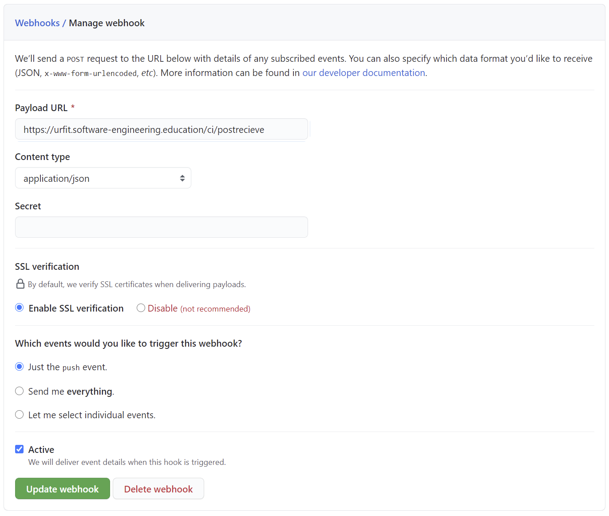

# UR Fit Continous Integration Documentation

This document outlines how the ci process for our ur fit process works and how it can be configured. It aims to report all major issues that might come up upon further modification.

## General Idea

Github webhooks send a http `post` request to a specified url after recieving updates from users.
These packages are recieved by an countinous integration server.
This server determines if any processes need to restart depending on the files that have changed.
If new dependencies need to be installed first, the ci server will also initiate a npm clean install.
The continous integration server can also restart itself, if its files have changed.

## Getting started

1) `git clone` the project onto the server.
2) `cd` into to project folder.
3) run `npm ci` to install dependencies.
4) run `npm i -g pm2` if pm2 library is not yet installed.
5) run `pm2 start` and wait about 30 seconds, everything is ready to go.

Check [urfit.software-developement.education/ci](https://review.software-developement.education/ci) to see the last ci-server log outputs.

## Prerequisites

the following packages need to be installed on the linux server:
- git
- nginx
- node
- npm
- gawk
- openssh

# Implementation and Configuration

**Context:** The Urfit website is hostet from a linux environment. Its backend server is using `node`. `Npm` is used as a build tool, defining scripts to start a developement or producation environment of the application. Since we are already working in an nodejs environment, the ci server is also implemented as a node server using [express](http://expressjs.com/).

## Process management

We want to keep the ci, developement and production safe and always running, no matter if the server restarts or the application crashes. Therefore all three applications are hosted in the process manager [pm2](https://pm2.keymetrics.io/). (The ci-server cannot be configured for usage with any other process manager). In the `pm2 ecosystem.config` file the server processes are specified, with their respective starting commands from to `package.json` file.

### pm2 config `~/ur-fit/ecosystem.config.js`
```javascript
module.exports = {
  apps : [
    {
      name: "ur-fit-ci",
      script: "npm",
      args: "run ci",
    },
    {
      name: "ur-fit-dev",
      script: "npm",
      args: "run start",
    },
    {
      name: "ur-fit-prod",
      script: "npm",
      args: "run build",
    }
  ]
}
```

## Webserver configuration

Since we are using multiple servers on the same machine, we need to use a reverse-proxy, to route different URLs to our correct servers. On our server `nginx` is the reverse proxy of choice. As can be seen bellow nginx defines to endpoints (called `server` but not to be confused with our node servers) for [urfit.software-engineering.education](https://urfit.software-engineering.education). The standard http endpoint on port 80 is always rerouted to secure https on port 443. The `location` setting are where the requests are redirected to there correct node servers. This is done in one of two ways:
- The productio environment has its own URL and configuration file similar to this one
- The developement server and ci server have their endpoints both on the urfit.software-engineering.education URL, but:
  - [urfit.software-engineering.education/](https://review.software-engineering.education) redirects to the dev server
  - [urfit.software-engineering.education/ci/](https://review.software-engineering.education/ci) redirects to the ci server

The three node servers differentiate themselfs by using different ports on localhost:
- `localhost:3330/`: ci-server (process: ur-fit-ci)
- `localhost:3000/`: developement server (process: ur-fit-dev)
- `localhost:5000/`: production server (process: ur-fit-prod)

> Important: Using one host (in this case `urfit.software-engineering.education`) for two react apps is not possible because of webpack. Webpack will bundle files to be served from root. As a result, the developement and production server cannot be accessed from the same host, because the reverse proxy well not work. (This is probably solvable with a more sofiticated configuration.)

### Nginx configuration file: `/etc/nginx/sites-available/urfit.software-engineering.education`
```nginx
server {
        listen 80;
        server_name urfit.software-engineering.education;
        return 301 https://urfit.software-engineering.education$request_uri;
}

server {
        listen 443 ssl;
        listen [::]:443 ssl;
        server_name urfit.software-engineering.education;

        ssl_certificate /etc/letsencrypt/live/urfit.software-engineering.education/fullchain.pem;
        ssl_certificate_key /etc/letsencrypt/live/urfit.software-engineering.education/privkey.pem;

        location /ci/ {
                proxy_pass http://127.0.0.1:3330/;
        }

        location / {
                proxy_pass http://127.0.0.1:3000/;
        }
}
```
## Github Webhooks configuration

Lets look at the github.com webhooks page then.
Here the ci updates are triggered on every push event. This can be configured to any onther event.
We need to specify the correct payload URL and content type. Content type must be `application/json`.
To reach the ci server we use the url specified in nginx -- `https://review.software-engineering.education/ci/` -- with the endpoint `postrecieve`.
This Endpoint needs to be specified in the `ci-server.config` as well.



## CI server configuration

The webserver uses the following config parameters:
- `webhookEndpoint` this should be equal to the webhook endpoint specified on github.
- `git`: object to specify the `remote` repository to pull from and the `ref` to pull.
- `requireInstall`: specifies a list of paths that require a clean install if they have been changed.
- `self`: app object as specified bellow for the ci server itself
- `apps` list of different servers that are running.

Every process - aka app - has the following properties:
- `name`: just a reference for other developers
- `processName`: this should be equal to the pm2 process name, used to trigger restarts (this uses glob pattern).
- `requireRestart`: specifies a list of paths that require a server restart if they have been changed.


### CI server config: `ci-server.config.js`
```javascript
module.exports = {
    git: {
        ref: "refs/heads/dev",
        remote: "origin"
    },
    webhookEndpoint: "postrecieve",
    requireInstall: [
        "package-lock.json"
    ],
    self: {
        name: "ci server",
        processName: "ur-fit-ci",
        requireRestart: [
            "ci/*"
        ]
    },
    apps: [
        {
            name: "dev server",
            processName: "ur-fit-dev",
            requireRestart: [
                "src/index.js",
                "src/service-worker.js",
                "src/serviceWorkerRegistration.js",
                "package.json"
            ],
        },
        {
            name: "production server",
            processName: "ur-fit-prod",
            requireRestart: [
                "src/**/*",
                "package.json"
            ],
        }
    ]
}
```

## Github Authentication

There is one important problem left to solve: Authenticating with github.com.

There are many solutions to this. In this case we use the ssh protocol. We have created a keypair and added it to github following this [guide](https://docs.github.com/en/github/authenticating-to-github/generating-a-new-ssh-key-and-adding-it-to-the-ssh-agent). _Important: This key should not have a passphrase!_ For the ci server to authenticate itself we need to specify the correct private key to use when sending requests to github.com. Therefore we specify this in the .ssh/config file.

### SSH config `~/.ssh/config`:
```
Host githubserver
    Hostname github.com
    IdentityFile ~/.ssh/ed25519.github
```

```bash
fzeiher@pcsl00138:~/ur-fit$ git remote -v
origin  git@githubserver:cetceeve/ci-test-ur-fit.git (fetch)
origin  git@githubserver:cetceeve/ci-test-ur-fit.git (push)
```

